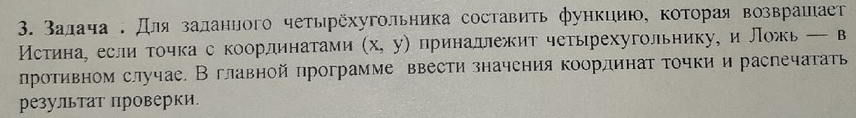

# Task 1

## Description



Для заданного четырёхугольника составить функцию, которая возвращает Истина, если точка с координатами (х, у) принадлежит четырехугольнику, и Ложь — в противном случае. В главной программе ввести значения координат точки и распечатать результат проверки.


## Solution

```C++
#include <iostream>

int product(float Px, float Py, float Ax, float Ay, float Bx, float By)
{
  return (Bx - Ax) * (Py - Ay) - (By - Ay) * (Px - Ax);
}

bool quadrilateral(float x, float y, float x1, float y1, float x2, float y2, float x3, float y3, float x4, float y4){
    float p1 = product(x, y, x1, y1, x2, y2);
    float p2 = product(x, y, x2, y2, x3, y3);
    float p3 = product(x, y, x3, y3, x4, y4);
    float p4 = product(x, y, x4, y4, x1, y1);
    if ((p1 < 0 && p2 < 0 && p3 < 0 && p4 < 0) ||
        (p1 > 0 && p2 > 0 && p3 > 0 && p4 > 0))
        return true;
    else
        return false;
}

int main(){
    float x, y, x1, y1, x2, y2, x3, y3, x4, y4;
    x1 = -2;
    y1 = 0;

    x2 = 0;
    y2 = 2;

    x3 = 3;
    y3 = 0;

    x4 = 0;
    y4 = -1;

    std::cin >> x >> y;
    if (quadrilateral(x, y, x1, y1, x2, y2, x3, y3, x4, y4)){
        std::cout << "точка с координатами (" << x <<"," << y << ") принадлежит четырехугольнику";
    } else {
        std::cout << "точка с координатами (" << x <<"," << y << ") не принадлежит четырехугольнику";
    }
}

```

## Пояснение

Если гарантируется, что четырехугольник выпукл и точки перечислены в каком-то порядке обхода, то задача решается элементарным образом, путем сравнения знаков произведений

```C++
(Bx - Ax) * (Py - Ay) - (By - Ay) * (Px - Ax)
```

где (Px, Py) - наша точка, а (Ax, Ay)-(Bx, By) - очередная сторона многоугольника, в каком-то фиксированном направлении обхода (например, против часовой стрелки). Если знаки совпадают, то точка лежит внутри. При обходе против часовой стрелки все такие произведения будут положительными, если точка лежит строго внутри. При обходе по часовой стрелке - отрицательными.

Например, для строгого вхождения

```C++
#include <iostream>

int product(int Px, int Py, int Ax, int Ay, int Bx, int By)
{
  return (Bx - Ax) * (Py - Ay) - (By - Ay) * (Px - Ax);
}

int main()
{
  int x, y, x1, y1, x2, y2, x3, y3, x4, y4;
  std::cin >> x >> y >> x1 >> y1 >> x2 >> y2 >> x3 >> y3 >> x4 >> y4;

  int 
    p1 = product(x, y, x1, y1, x2, y2),
    p2 = product(x, y, x2, y2, x3, y3),
    p3 = product(x, y, x3, y3, x4, y4),
    p4 = product(x, y, x4, y4, x1, y1);

  if ((p1 < 0 && p2 < 0 && p3 < 0 && p4 < 0) ||
      (p1 > 0 && p2 > 0 && p3 > 0 && p4 > 0))
    std::cout << "Vhodit" << std::endl;
  else
    std::cout << "Ne vhodit" << std::endl;
}
```

Но если не гарантируется упорядоченное перечисление точек, то сначала вам самостоятельно придется их упорядочить.