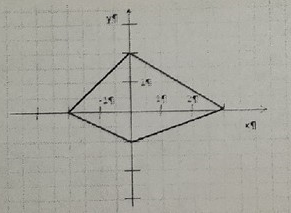

# Task 1

## Description

Для заданного четырёхугольника составить функцию, которая возвращает Истина, если точка с координатами (х, у) принадлежит четырехугольнику, и Ложь - в противном случае. В главной программе ввести значения координат точки и распечатать результат проверки.



## Solution

```C++

```