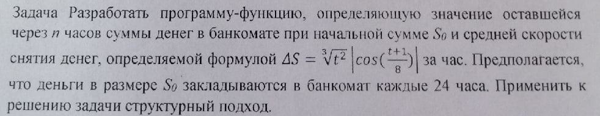

# Task 10

## Description



Разработать программу-функцию, определяющую значение оставшейся через n часов суммы денег в банкомате при началыюй сумме S0 и средней скорости снятия денег, определяемой формулой ΔS = sqrt\[3\]\(t^2\)*|cos((t + 1)/8)| за час. Предполагается, что деньги в размере S0 закладываются в банкомат каждые 24 часа. Применить к решению задачи структурный подход.

## Solution

```C++

```