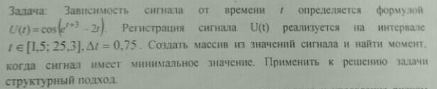
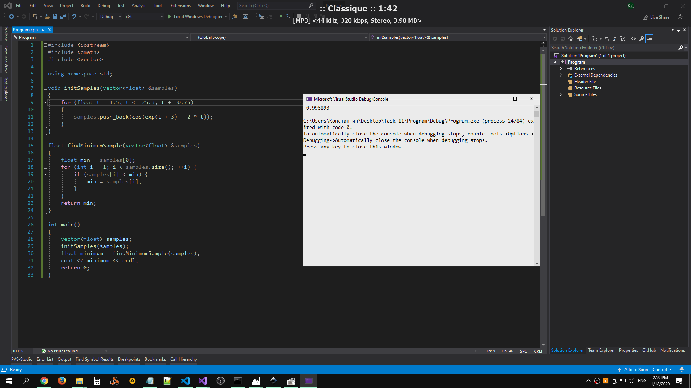
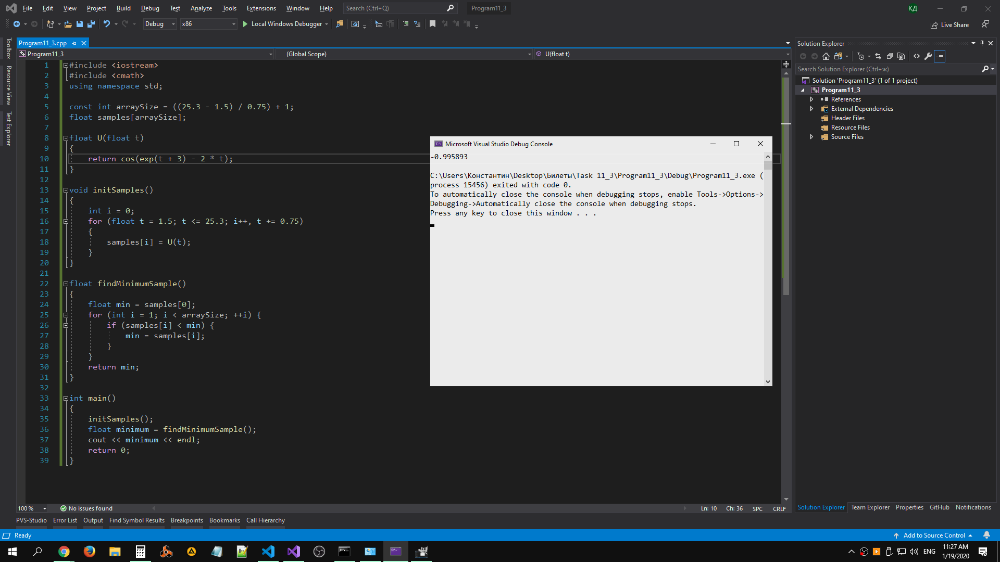

# Task 11

## Description



Зависимость сигнала от времени t определяется формулой U(t) = cos(e^(t+3)-2t). Регистрация сигнала U(t) реализуется на интервале t ∈ \[1,5; 25,3\], Δt = 0,75. Создать массив из значений сигнала и найти момент, когда сигнал имеет минимальное значение. Приминить к решению задачи структурный подход.

## Solution

### 1

Решение без структурного подхода.

```C++
#include <iostream>
#include <cmath>
#include <vector>
using namespace std;

int main()
{
    vector<float> samples;
    
    // find all values
    for (float t = 1.5; t <= 25.3; t += 0.75) {
        samples.push_back(cos(exp(t+3) - 2*t));
    }

    float min = samples[0];
    for (int i = 1; i < samples.size(); ++i) {
        if (samples[i] < min) {
            min = samples[i];
        }
    }

    cout << min << endl;
    return 0;
}
```

### 2

Решение со структурным подходом.

```C++
#include <iostream>
#include <cmath>
#include <vector>
using namespace std;

void initSamples(vector<float> &samples)
{
    for (float t = 1.5; t <= 25.3; t += 0.75)
    {
        samples.push_back(cos(exp(t + 3) - 2 * t));
    }
}

float findMinimumSample(vector<float> &samples)
{
    float min = samples[0];
    for (int i = 1; i < samples.size(); ++i) {
        if (samples[i] < min) {
            min = samples[i];
        }
    }
    return min;
}

int main()
{
    vector<float> samples;
    initSamples(samples);
    float minimum = findMinimumSample(samples);
    cout << minimum << endl;
    return 0;
}
```

### 3

Решение со структурным подходом и без использования `std::vector`.

```C++
#include <iostream>
#include <cmath>
using namespace std;

const int arraySize = ((25.3 - 1.5) / 0.75) + 1;
float samples[arraySize];

float U(float t)
{
    return cos(exp(t + 3) - 2 * t);
}

void initSamples()
{
    int i = 0;
    for (float t = 1.5; t <= 25.3; i++, t += 0.75)
    {
        samples[i] = U(t);
    }
}

float findMinimumSample()
{
    float min = samples[0];
    for (int i = 1; i < arraySize; ++i) {
        if (samples[i] < min) {
            min = samples[i];
        }
    }
    return min;
}

int main()
{
    initSamples();
    float minimum = findMinimumSample();
    cout << minimum << endl;
    return 0;
}
```

## Example

### 2



### 3


