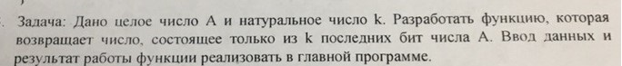

# Task 13

## Description



Дано целое число А и натyральное число k. Разработать функцию, которая возвращает число, состоящее только из k последних бит числа А. Ввод данных и результат работы функции реализовать в главной программе.

## Solution

```C++
#include <iostream>

int getBitByPosition(int k)
{
    int bit = 1;
    for (int i = 0; i < k; i++)
    {
        bit *= 2;
    }
    return bit;
}

int slice(int A, int k)
{
    return A % getBitByPosition(k);
}

int main()
{
    int A, k;
    cin >> A >> k;
    сout << "Number with k last bits of A: " << slice(A, k)  <<  endl;
    system("pause");
    return 0;
}
```
