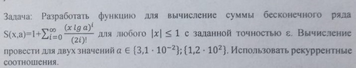

# Task 14

## Description



Разработать функцию для вычисления суммы бесконечного ряда S(x,a) = 1 + Σ from i = 0 to ∞ ((x\*lg(a))^i/(2i)!) для любого |x| <= 1 с заданной точностью ε. Вычисление провести для двух значений а ∈ {З,1\*10^(-2)}; {1,2\*10^2}. Использовать рекуррентные соотношения.

## Solution

```C++
#include <iostream>
#include <cmath>

using namespace std;

double summ(double x, double a, double e) {
    double S = 1;
    double addendum = 1;
    
    for (int i = 1; abs(addendum *= (x * log10(a) / 2*i)) >= e; ++i) {
        S += addendum;
    }
    return S;
}

int main()
{
    double a, x, e;
    cout << "Enter x: ";
    cin >> x;
    cout << "Enter e: ";
    cin >> e;

    a = 0.031;
    cout << "Summ is: " << summ(x, a, e) << endl;

    a = 120;
    cout << "Summ is: " << summ(x, a, e) << endl;
    
    return 0;
}
```
