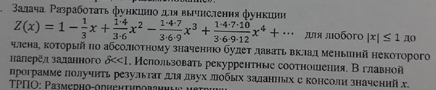

# Task 15

## Description



Разработать функцию для вычисленя функции
Z(x)=1-1/3\*x+1\*4\*x^2/3\*6-1\*4\*7\*x^3/3\*6\*9+1\*4\*7\*10\*x^4/3\*6\*9\*12+... для любого |x|<=1 до члена. который по абсолютному значению будет давать вклад меньший некоторого наперед δ<<1. Использовать рекуррентные соотношения.  главное программе получить результат для двух любых заданных с консоли значений x.

## Solution

```C++
#include <iostream>
#include <cmath>

using namespace std;

double summ(double x, double d) {
    double S = 1;
    double addendum = 1;
    long long numerator = 1, denumerator = 3;

    for (int i = 1; abs(addendum *= -(x * double(numerator) / double(denumerator))) >= d; ++i) {
        S += addendum;
        numerator += 3;
        denumerator += 3;
    }
    return S;
}

int main()
{
    double x, d;

    cout << "Enter delta: ";
    cin >> d;

    for (int i = 0; i < 2; ++i) {
        cout << "Enter x: ";
        cin >> x;
        cout << "Summ is: " << summ(x, d) << endl;
    }

    return 0;
}

```
