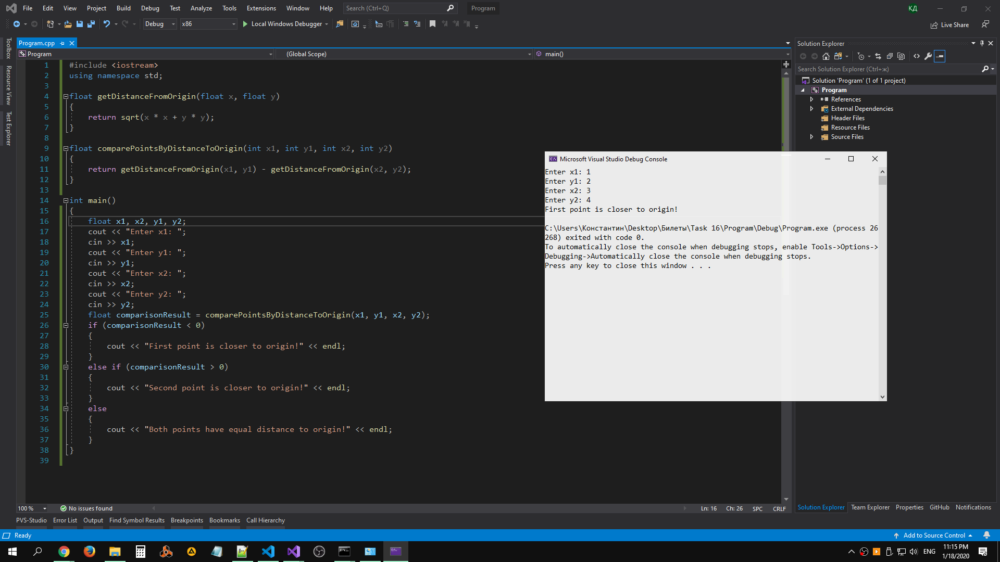

# Task 16

## Description


Даны две точки A(x1,y1) и B(x2,y2). Составить алгоритм, определяющий, которая из точек находится ближе к началу координат. Решение оформить в виде функции, определяющей номер точки - 1 или 2, наиболее близкой к началу координат, и главной программы, вызывающей эту функцию.

## Solution

```C++
#include <iostream>
#include <cmath>
using namespace std;

float getDistanceFromOrigin(float x, float y)
{
    return sqrt(x * x + y * y);
}

float comparePointsByDistanceToOrigin(int x1, int y1, int x2, int y2)
{
    return getDistanceFromOrigin(x1, y1) - getDistanceFromOrigin(x2, y2);
}

int main()
{
    float x1, x2, y1, y2;
    cout << "Enter x1: ";
    cin >> x1;
    cout << "Enter y1: ";
    cin >> y1;
    cout << "Enter x2: ";
    cin >> x2;
    cout << "Enter y2: ";
    cin >> y2;
    float comparisonResult = comparePointsByDistanceToOrigin(x1, y1, x2, y2);
    if (comparisonResult < 0)
    {
        cout << "First point is closer to origin." << endl;
    }
    else if (comparisonResult > 0)
    {
        cout << "Second point is closer to origin." << endl;
    }
    else
    {
        cout << "Both points have equal distance to origin." << endl;
    }
}
```

## Example


