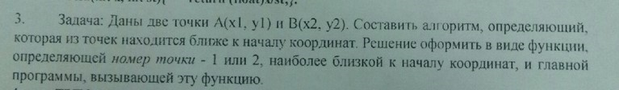

# Task 16

## Description



Даны две точки A(x1,y1) и B(x2,y2). Составить алгоритм, определяяющий, которая из точек находится ближе к началу координат. Решение оформить в виде функции, определяющей номер точки - 1 или 2, наиболее близкой к началу координат, и главной программы, вызывающей эту функцию.

## Solution

```C++

```
