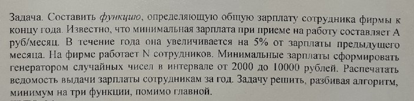

# Task 2

## Description



Составить функцию, определяющую общую зарплату сотрудника фирмы к концу года. Известно, что минимальная зарплата при приеме на работу составляет А руб/месяц. В течение года она увеличивается на 5% от зарплаты предыдущего месяца. На фирме работает N сотрудников. Минимальные зарплаты сформировать генератором случайных чисел в интервале от 2000 до 10000 рублей. Распечатать ведомость выдачи зарплаты сотрудникам за год. Задачу решить, разбивая алгоритм, минимум на три функции, помимо главной.

## Solution

```C++
#include <iostream>
using namespace std;

void zarp(int &A) // функция нахождения минимальной зарплаты сотрудников, где А - мин. зарплата
{
	A = rand() % (10000 - 2000 + 1) + 2000;
};

void uv(int &B)
{
	int i = 1, n = 12;
	for (;i <= n; i++)
	{
		B = B + ((B / 100) * 5);
		cout << "Zarplata sotrudnika za " << i << "-i mesyac: " << B << endl;
	}
};

int main()
{
	setlocale(LC_ALL, "Russian");
	int i, N, K;
	cout << "Введите количество сотрудников: "; cin >> N;
	K = N;
	for (i = 1; i <= K; i++)
	{
		zarp(N);
		uv(N);
		cout << "Зарплата " << i << "-го сотрудника: " << N << endl;
	}
	system("pause");
	return 0;
}
```