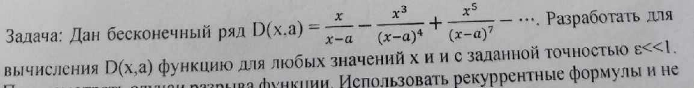

# Task 20

## Description



Дан бесконечный ряд D(х,а) = х/(x-a) - x^3/(x-a)^4 + x^5/(x-a)^7 - …. Разработать для вычисления D(х,а) функцию для любых значений х и a с заданной точностью ε<<1. Использовать рекуррентные формулы и не ... 

## Solution

```C++

```