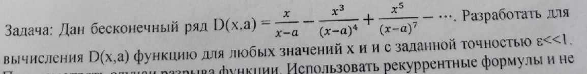
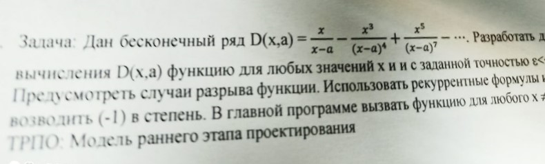

# Task 20

## Description




Дан бесконечный ряд D(х,а) = х/(x-a) - x^3/(x-a)^4 + x^5/(x-a)^7 - …. Разработать для вычисления D(х,а) функцию для любых значений х и с заданной точностью ε<<1.Предусмотреть случаи разрыва  функции. Использовать рекуррентные формулы и не возводить (-1) в степень. В главной программе вызвать функцию для любого x!=a.

## Solution

```C++

```
