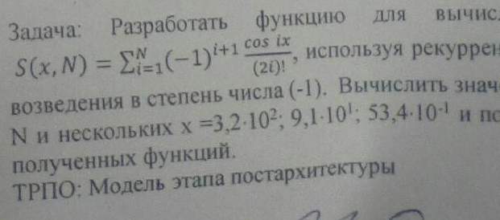

# Task 21

## Description



Разработать функцию для вычисления ...
 S(x,N) = Σ from i = 1 to N ( ((-1)^(i+1)) \* (cos(i\*x)/(2\*i)!) ), используя рекуррентные соотношения

возведения в степень числа (-1). Вычислить значения

N и нескольких х = 3,2\*10^2; 9,1\*10^1; 53,4\*10^(-1) и по

полученных функций.

## Solution

```C++

```