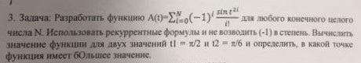

# Task 23

## Description



Разработать функцию А(t) = ∑ from i = 1 to N ((-1)^i \* ((sin(t))^(2\*i))/i!), для любого конечного целого числа N. Использовать рекуррентные формулы и не возводить (-1) в степень. Вычислить значение функции для двух значений t1 = π/2 и t2 = π/б и определить, в каков точке функция имеет бОльшее значение.

## Solution

```C++

```
