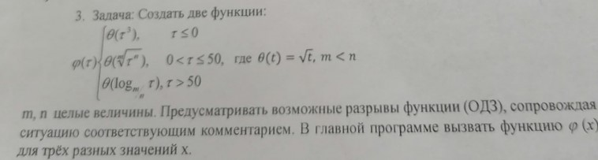

# Task 24

## Description



Создать две функции:
```
φ(τ){
    θ(τ^3), τ <= 0
    θ(sqrt[m](τ^n)), 0 < τ <= 50, где θ(τ) = sqrt(τ), m < n
    θ(log[m/n](τ)), τ > 50
}
```
m,n целые величины. Предусматривать возможные разрывы функции(ОДЗ), сопровождая ситуацию соответствующим комментарием. В главной программе вызвать функцию φ(x) для трех разных значений x.

## Solution

```C++

```
