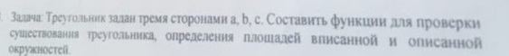

# Task 25

## Description



Треугольник задан тремя сторонами а, b, с. Составить функции для проверки существования треугольника, определения площадей вписанной и описанной окружности.

## Solution

```C++

```
