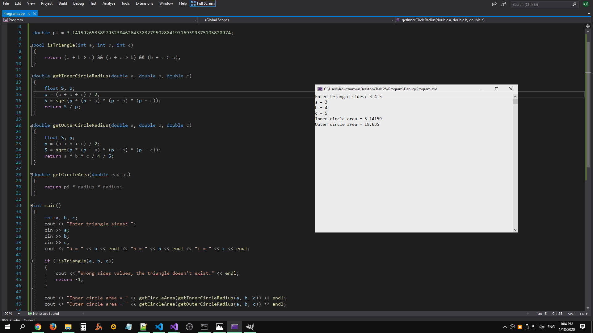

# Task 25

## Description


Треугольник задан тремя сторонами а, b, с. Составить функции для проверки существования треугольника, определения площадей вписанной и описанной окружности.

## Solution

```C++
#include <iostream>
#include <cmath>
using namespace std;

double pi = 3.141592653589793238462643383279502884197169399375105820974;

bool isTriangle(int a, int b, int c)
{
    return (a + b > c) && (a + c > b) && (b + c > a);
}

double getInnerСircleRadius(double a, double b, double c)
{
    float S, p;
    p = (a + b + c) / 2;
    S = sqrt(p * (p - a) * (p - b) * (p - c));
    return S / p;
}

double getOuterСircleRadius(double a, double b, double c)
{
    float S, p;
    p = (a + b + c) / 2;
    S = sqrt(p * (p - a) * (p - b) * (p - c));
    return a * b * c / 4 / S;
}

double getCircleArea(double radius)
{
    return pi * radius * radius;
}

int main()
{
    int a, b, c;
    cout << "Enter triangle sides: ";
    cin >> a;
    cin >> b;
    cin >> c;
    cout << "a = " << a << endl << "b = " << b << endl << "c = " << c << endl;

    if (!isTriangle(a, b, c))
    {
        cout << "Wrong sides values, the triangle doesn't exist." << endl;
        return -1;
    }

    cout << "Inner circle area = " << getCircleArea(getInnerСircleRadius(a, b, c)) << endl;
    cout << "Outer circle area = " << getCircleArea(getOuterСircleRadius(a, b, c)) << endl;

    cin.ignore();
    cin.get();
    return 0;
}
```

## Explanation

https://en.wikipedia.org/wiki/Incircle_and_excircles_of_a_triangle

## Example


