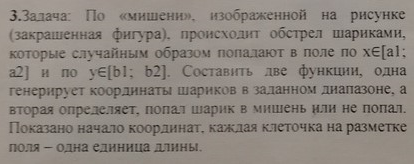
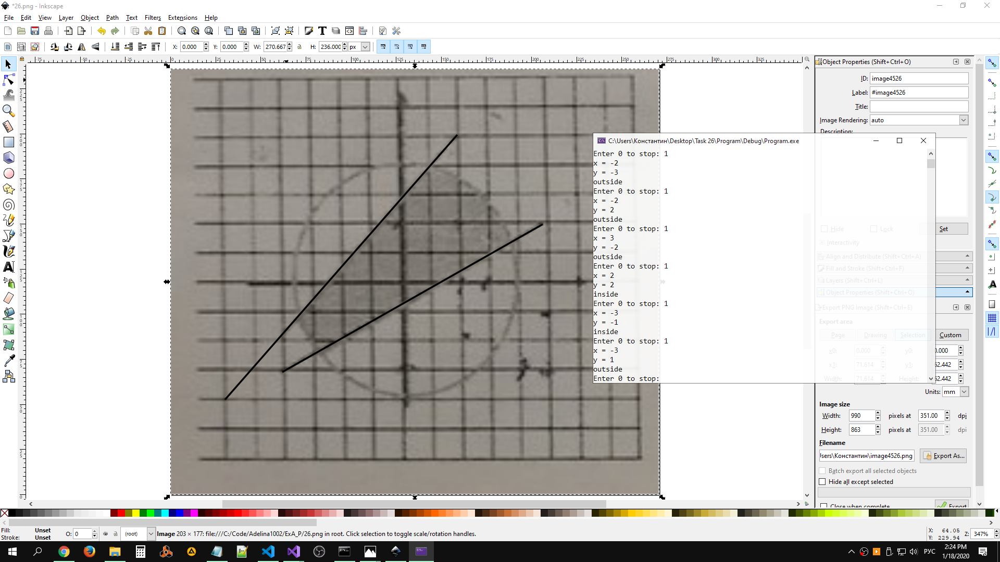

# Task 26

## Description



По «мишени», изображённой на рисунке (закрашенная фигура), происходит обстрел шариками, которые случайным образом попадают в поле x ∈ \[a1; a2\] и по y ∈ \[b1; b2\]. Составить две функции, одна генерирует координаты шариков в заданном диапазоне, а вторая определяет, попал шарик в мишень или не попал. Показано начало координат, каждая клеточка на разметке поля — одна единица длины.


## Solutions

### 1
Решение неточное, так как по рисунку сложно определить точные коэффиценты в уравнениях прямых. 

```C++
#include <iostream>
#include <cmath>
#include <utility> // std::pair
#include <random>

using namespace std;

bool inField(float x, float y) {
    return ((x * x + y * y) < 16) && (y > (2 * x / 3 - 1)) && (y < (x + 3));
}

pair<float, float> generatePoint(float a1, float a2, float b1, float b2) {
    return make_pair<float, float>(float(rand()) / float(RAND_MAX) * (a2-a1) + a1,
                                   float(rand()) / float(RAND_MAX) * (b2-b1) + b1);
}

int main()
{
    float a1, a2, b1, b2;
    cin >> a1 >> a2 >> b1 >> b2;
    
    for (int i = 0; i < 10; ++i) {
        auto [x, y] = generatePoint(a1, a2, b1, b2);
        cout << "Generated point: (" << x << ", " << y << ")\n";
        cout << "In field: " << boolalpha << inField(x, y) << endl;
    }

    return 0;
}
```

### 2

```C++
#include <iostream>
#include <cmath>
#include <random>
using namespace std;

bool isPointInsideCircle(double circleCenterX, double circleCenterY, double circleRadius, double pointX, double pointY)
{
    return pow(pointX - circleCenterX, 2) + pow(pointY - circleCenterY, 2) <= pow(circleRadius, 2);
}

void initLineEquationFrom2Points(double line[], double firstPointX, double firstPointY, double secondPointX, double secondPointY)
{
    line[0] = secondPointY - firstPointY;
    line[1] = -(secondPointX - firstPointX);
    line[2] = firstPointY * secondPointX - firstPointX * secondPointY;
}

double getPointPositionRelativeToLine(double line[], double pointX, double pointY)
{
    return -(line[0] * pointX + line[1] * pointY + line[2]);
}

bool isInsideTheRegion(double radius, double upperLine[], double lowerLine[], double pointX, double pointY)
{
    return isPointInsideCircle(0, 0, radius, pointX, pointY) && getPointPositionRelativeToLine(upperLine, pointX, pointY) <= 0 && getPointPositionRelativeToLine(lowerLine, pointX, pointY) >= 0;
}

int main()
{
    std::random_device rd; // obtain a random number from hardware
    std::mt19937 generator(rd()); // seed the generator
    const double radius = 4;
    double upperLine[3];
    double lowerLine[3];

    initLineEquationFrom2Points(upperLine, -6, -4, 2, 5); // (-6, -4); (2, 5)
    initLineEquationFrom2Points(lowerLine, -4, -3, 5, 2); // (-4, -3); (5, 2)

    int a1, a2, b1, b2;

    cout << "Enter range for x values: ";
    cin >> a1;
    cin >> a2;

    cout << "Enter range for y values: ";
    cin >> b1;
    cin >> b2;

    std::uniform_int_distribution<> a(a1, a2);
    std::uniform_int_distribution<> b(b1, b2);

    double x, y;

    int i = 1;
    while (i != 0)
    {
        x = a(generator);
        y = b(generator);

        cout << "x = " << x << endl;
        cout << "y = " << y << endl;

        if (isInsideTheRegion(radius, upperLine, lowerLine, x, y))
        {
            cout << "inside" << endl;
        }
        else
        {
            cout << "outside" << endl;
        }

        cout << "Enter 0 to stop: ";
        cin >> i;
    }

    cin.ignore();
    cin.get();
    return 0;
}
```

## Example

### 2


