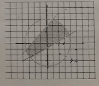

# Task 26

## Description

По "мишени", изображённой на рисунке (закрашенная фигура), происходит обстрел шариками, которые случайным образом попадают в поле x ∈ \[a1; a2\] и по y ∈ \[b1; b2\]. Сставить две функции, одна генерирует координаты шариков в заданном диапазоне, а вторая определяет, попал шарик в мишень или не попал. Показано начало координат, каждая клеточка на разметке поля — одна единица длины.



## Solution

```C++

```
