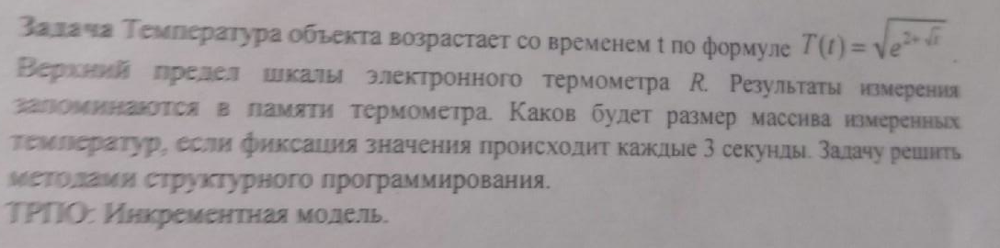

# Task 3

## Description



Температура объекта возрастает со временем t по формуле Т(t) = sqrt(e^(2+sqrt(t))). Верхний предел шкалы электронного термометра R. Результаты измерения запоминаются в памяти термометра. Каков будет размер массива измеренных температур, если фиксация значения происходит каждые 3 секунды. Задачу решить методами структурного программирования.

## Solution

```C++
#include <iostream>
#include <cmath>
using namespace std;

int tem(float R)
{
	float T = 0,t = 0;
	int k = 0;
	while (T<R)
	{
		T = sqrt(exp(2 + sqrt(t)));
		t = t + 3;
		cout << T << " ";
		k++;
	}
	return k;
}
int main()
{
	float R;
	cin >> R;
	cout << endl << "kol-vo = " << tem(R);
	return 0;
}
```