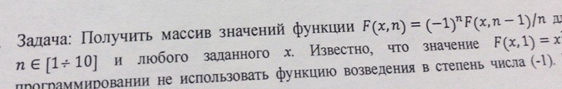

# Task 4

## Description



Получить массив значений функции F(x,n)=(-1)^(n)\*F(x,n-1)/n для n\[110\] и любого заданного x. Известно, что F(x,1)=x^2.
Не использовать функцию возведения в степень числа -1

## Solution

```C++

```