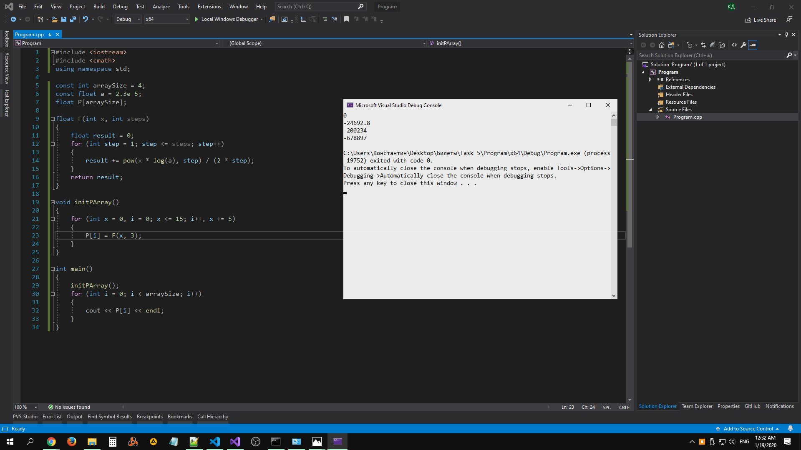
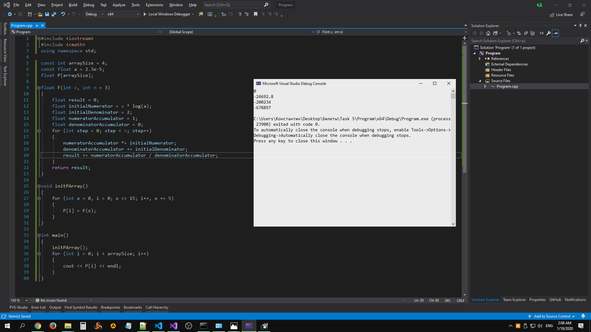

# Task 5

## Description


Сформировать массив Р\[\] из значений функции F(x) = (x\*ln(a))/2 + ((x\*ln(a))^2)/4 + ((x\*ln(a))^3)/6 на интервале x ∈ \[0; 15\], Δx = 5. Параметр а = 2,3\*10-5. Массив означает, что, например, Р\[1\]=F(0), Р\[2\]=F(5) и т.д. Вычисление функции производить с помощью алгоритма накопления суммы конечного ряда с применением рекуррентных соотношений. Вывести полученный массив в консоль. Задачу решить методами структyрного программирования.

## Solution

### 1

With `pow()`.

```C++
#include <iostream>
#include <cmath>
using namespace std;

const int arraySize = 4;
const float a = 2.3e-5;
float P[arraySize];

float F(int x, int steps)
{
    float result = 0;
    for (int step = 1; step <= steps; step++)
    {
        result += pow(x * log(a), step) / (2 * step);
    }
    return result;
}

void initPArray()
{
    for (int x = 0, i = 0; x <= 15; i++, x += 5)
    {
        P[i] = F(x, 3);
    }
}

int main() 
{
    initPArray();
    for (int i = 0; i < arraySize; i++)
    {
        cout << P[i] << endl;
    }
}
```

### 2

Without `pow()`.

```C++
#include <iostream>
#include <cmath>
using namespace std;

const int arraySize = 4;
const float a = 2.3e-5;
float P[arraySize];

float F(int x, int n = 3)
{
    float result = 0;
    float initialNumerator = x * log(a);
    float initialDenominator = 2;
    float numeratorAccumulator = 1;
    float denominatorAccumulator = 0;
    for (int step = 0; step < n; step++)
    {
        numeratorAccumulator *= initialNumerator;
        denominatorAccumulator += initialDenominator;
        result += numeratorAccumulator / denominatorAccumulator;
    }
    return result;
}

void initPArray()
{
    for (int x = 0, i = 0; x <= 15; i++, x += 5)
    {
        P[i] = F(x);
    }
}

int main() 
{
    initPArray();
    for (int i = 0; i < arraySize; i++)
    {
        cout << P[i] << endl;
    }
}
```

## Example

### 1

https://repl.it/@Konard/HandsomeAwesomePup


### 2

https://repl.it/@Konard/CaringLightcyanUser
