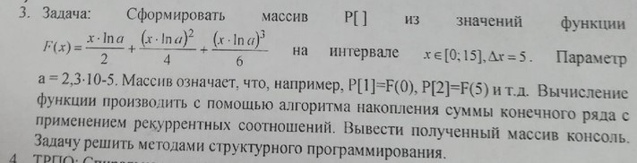

# Task 5

## Description



Сформировать массив Р\[\] из значений функции F(x) = (x\*ln(a))/2 + ((x\*ln(a))^2)/4 + ((x\*ln(a))^3)/6 на интервале x ∈ \[0; 15\], Δx = 5. Параметр а = 2,3\*10-5. Массив означает, что, например, Р\[1\]=F(0), Р\[2\]=F(5) и т.д. Вычисление функции производить с помощью алгоритма накопления суммы конечного ряда с применением рекуррентные соотношений. Вывести полученный массив в консоль. Задачу решить методами структyрного программирования.

## Solution

```C++

```