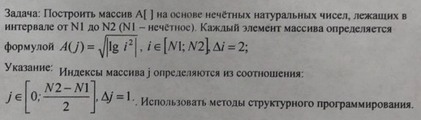

# Task 6

## Description



Построить массив А\[\] на основе нечётных натуральных чисел, лежащих в интервале от N1 До N2 (N1 — нечетное число). Каждый элемент массива определяется формулой А(j) = sqrt(|lg(i^2)|), i ∈ \[N1; N2\], Δi = 2;

Указание:
Индексы массива j определяются из соотношения:
j ∈ \[0; (N2-N1)/2\], Δj = 1.

Использовать методы структурного программирования.

## Solution

```C++
#include <iostream>
#include <cmath>

using namespace std;

double createArrElement(int i) {
    return sqrt(log10(i * i));
}

void createArr(double * arr, int N1, int N2) {
    for (int j = 0, i = N1; i < N2; i += 2, j += 1) {
        arr[j] = createArrElement(i);
    }    
}

void printArr(double *arr, int size) {
    for (int j = 0; j < size; ++j) {
        cout << arr[j] << endl;
    }
}

int main()
{
    int N1, N2;
    cout << "Enter N1 and N2: ";
    cin >> N1 >> N2;

    int size = (N2-N1 / 2) + 1;
    double A[size];

    createArr(A, N1, N2);
    printArr(A, size);
    
    return 0;
}

```
