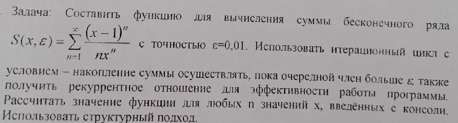

# Task 7

## Description



Составить функцию для вычисления суммы бесконечного ряда S(x,ε) = Σ from n = 1 to ∞ ((x - 1)^n/n\*x^n) с точностью ε=0,01. Использовать итерационный цикв с условием — накопление суммы осуществлять, пока очередной член больше ε, также получить рекуррентное отношение для эффекгивности работы программы. Рассчитать значение функции для любых n значений х, введенных с консоли.
Использовать структурный подход.

## Solution

```C++
#include <iostream>
#include <cmath>
using namespace std;

float summ(int x)
{
	int n = 1;
	float a, aa, b, step, s, e = 1e-2;
	for(step = 1, s = 0; step > e; n++)
	{
		aa = (x - 1);
		a = pow(aa, n);
		b = n * pow(x, n);
		step = a / b;
		s + = step;
	}
	return s;
}

void printf(int x)
{
	cout << " s = " << summ(x);
}

int main()
{
	float s;
	int x, n;
	cout << " Enter x>1 " << endl;
	cin >> x;

	printf(x);

	system("pause");
	return 0;
}

//-----------------------------------------
#include <iostream>
#include <cmath>
using namespace std;

const double eps=0.01;

double summiter(double x)
{
    double sum=0.0, member=0.0;
    int n=1;
    do
    {
        member=pow((x-1), n)/(n*pow(x,n));
        sum+=member;
        n++;
    } while (member>=eps);
    return sum;
}

double summrec(double x)
{
    double sum=0.0, member=0, rad=1;
    int n=1;
    do
    {
        rad*=(x-1)/x;
        member=rad/n;
        sum+=member;
        n++;
    } while (member>=eps);
    return sum;
}
int main()
{
    cout<<summiter(5)<<endl;
    cout<<summrec(5)<<endl;
    return 0;
}
/------------------------------------------

```
