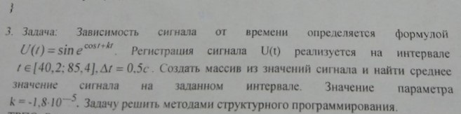

# Task 8

## Description



Зависимость сигнала от времени определяется формулой U(t)=sin(e^(cost+kt)). Регистрация сигнала U(t) реализуется на интервале t\[40.2;85,4\],Δt=0,5c/ Создать массив из значений сигнала и найти среднее значение сигнала на заданном интервале. Значение параметра k=-1.8\*10^(-5)/ Задачу решить методом структурного программирования.

## Solution

```C++

```
