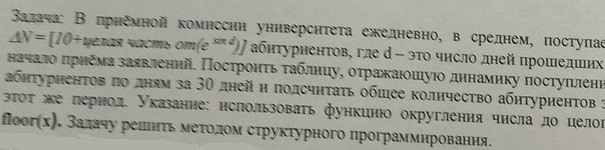

# Task 9

## Description



В приемной комиссии университета ежедневно, в среднем, поступают ΔN=\[10+целая часть от(e^(sind)\] абитуриентов, где d - это число дней прошедшихс начало приема заявлениц. Построить таблицу, отражающую динамику поступлени абитуриентов по дням за 30 дней и подсчитать общее количество абитуриентов за этот же период. Указание: использовать функцию округления числа целого floor(x). Задачу решить методом сструктурного программирования.

## Solution

```C++

```
